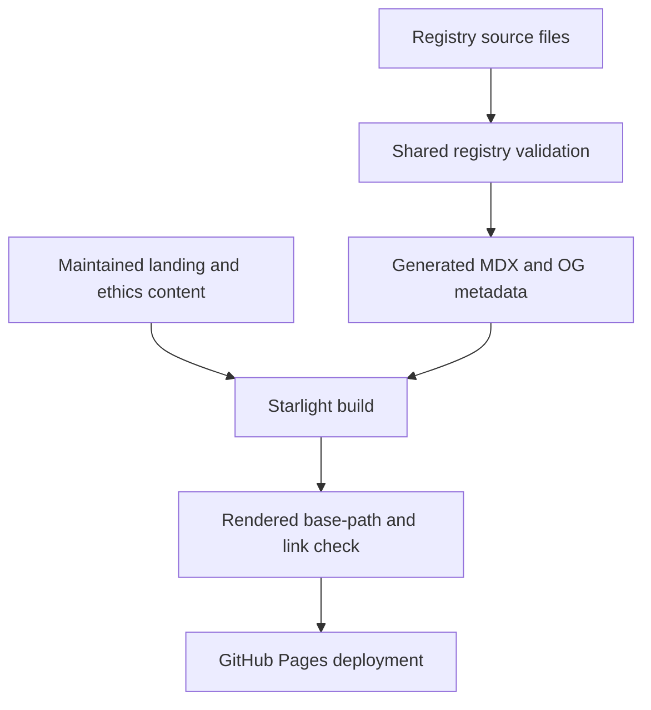
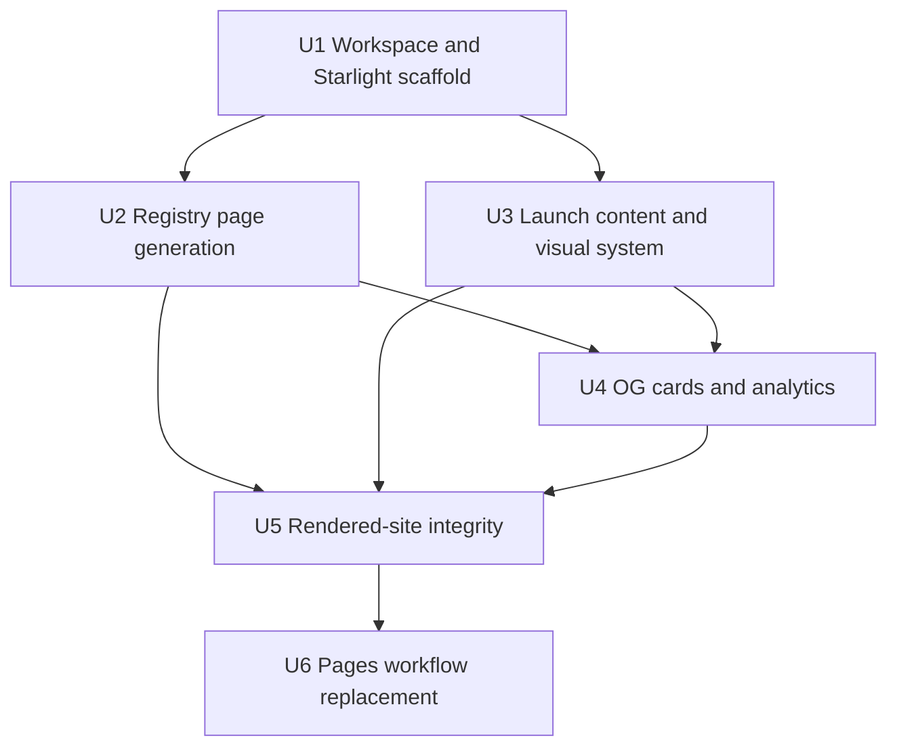
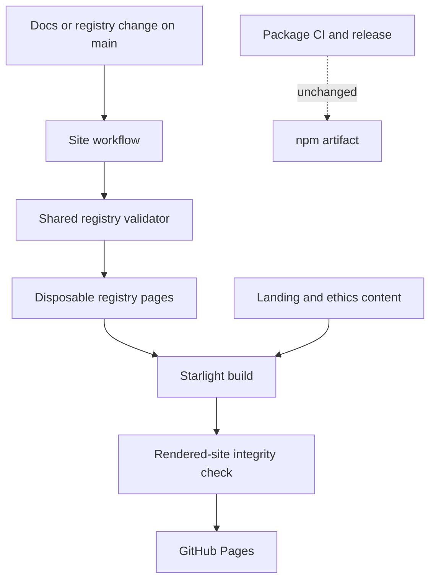

# feat: Build the dev-like docs site

## Overview

Build a Starlight site at `mrbro.dev/dev-like/` that explains dev-like in one screen,
shows the Every before-and-after evidence, exposes the registry as browsable cited profiles,
and makes consent and opt-out rules visible. The site deploys from this repository whenever
docs or registry data changes, independently of npm releases.

The registry remains the source of truth. A deterministic pre-build generator validates it,
then produces gitignored Starlight content and per-entry social-card data without copying
registry content into maintained site files.

---

## Problem Frame

Launch traffic needs a product surface that communicates the result and reaches an install
command without requiring visitors to inspect repository files. The current Pages stub proves
that the final `/dev-like/` route works, but it does not expose the demo, registry evidence,
or ethics story required for launch (see origin:
`docs/brainstorms/2026-07-12-docs-site-requirements.md`).

The origin document supersedes the stale deployment shape in `DESIGN.md`: source lives in
`docs/`, and this repository deploys directly to its own GitHub Pages site rather than pushing
build output to another repository.

---

## Requirements Trace

| ID | Requirement | Planned coverage |
|---|---|---|
| R1 | Create a Starlight site in `docs/` from the proven Systematic configuration, audited for same-repository deployment. | U1 |
| R2 | Use `https://mrbro.dev` with base path `/dev-like`; preserve the base in links, assets, metadata, and sitemap output. | U1, U5 |
| R3 | Deploy independently of npm releases on changes to docs or registry data, plus manual dispatch. | U6 |
| R4 | Keep docs dependencies, tests, and output out of the published npm package and package test path. | U1, U6 |
| R5 | Put the product explanation, three install paths, and abridged Every demo on the landing page. | U3 |
| R6 | Generate a registry index and per-entry profile pages from registry data at build time. | U2 |
| R7 | Show the correct prebuilt-skill or live-generation install path for each entry. | U2 |
| R8 | Keep install, first run, on-disk result, and compact harness notes on the landing page. | U3 |
| R9 | Publish consent tiers, person floor, provenance rules, and the 48-hour opt-out process. | U3 |
| R10 | Generate entry-specific OG cards with a default site-card fallback. | U4 |
| R11 | Load cookieless self-hosted Umami only for production builds with a configured website ID. | U4 |
| R11a | Track named install, profile-request, and opt-out/contact CTA events. | U3, U4 |
| R12 | Validate registry data through `scripts/validate.mjs` and fail the site build on invalid data. | U2 |
| R13 | Use one primary landing CTA, with registry browsing and alternate installs secondary. | U3 |

---

## Scope Boundaries

- No separate quickstart, harness matrix, CLI reference, custom search, or profile-request
  pitch page in the launch cut.
- No site-maintained copies of registry profiles or entry metadata.
- No CLI telemetry, cookies, PII collection, third-party analytics, or consent banner.
- No Playwright dependency for OG generation or routine site verification.
- No performance-budget tooling beyond one production-build and rendered-page check.
- No essay hosting; the launch essay remains on the main `mrbro.dev` publishing path.
- No npm release coupling; the site follows docs and registry changes on `main`.

### Deferred to Separate Tasks

- Normalize registry citation syntax at the source: follow-up registry migration after launch;
  the launch generator converts current `[[label]](url)` citations at build time.
- Full harness matrix and CLI reference: post-launch documentation expansion.
- Dedicated profile-request pitch: post-launch work; this site only links the existing request
  form.

---

## Context and Research

### Relevant Code and Patterns

- `package.json` uses an explicit npm `files` allowlist that already excludes `docs/`.
- `scripts/validate.mjs` exports `validate()`, so the docs generator can use the existing
  invariant gate without duplicating validation logic.
- `scripts/check-links.mjs` and `tests/check-links.test.mjs` establish the repository's
  built-in-module script and Node test style; the docs link checker should follow that shape
  without sharing the external provenance-link concern.
- `.github/workflows/site.yaml` is the routing-probe stub to replace, not extend.
- `docs/demo/every-dryrun-2026-07-11.md` is the source for the abridged landing-page demo.
- `registry/OPTOUT.md`, `.github/ISSUE_TEMPLATE/optout.yml`, and
  `.github/ISSUE_TEMPLATE/profile-request.yml` are the authoritative ethics and CTA targets.
- Systematic's docs package provides the Starlight dependency versions, base-path config,
  Mermaid setup, sidebar shape, conditional Umami head entry, and generate-then-build pattern.

### Institutional Learnings

- `docs/solutions/best-practices/bun-changesets-oidc-release-pipeline-2026-07-11.md`
  confirms that npm publishing is a separate workflow and must remain unaffected by docs work.
- Generated content should be deterministic, disposable, and ignored; source records remain
  reviewable in their original location.
- Base-path correctness must be checked against rendered output, not inferred from source
  configuration alone.

### External References

- [Starlight configuration reference](https://starlight.astro.build/reference/configuration/)
- [Astro GitHub Pages deployment guide](https://docs.astro.build/en/guides/deploy/github/)
- [astro-og-canvas](https://github.com/delucis/astro-og-canvas)
- [Umami event tracking](https://umami.is/docs/track-events)

---

## Key Technical Decisions

| ID | Decision | Rationale |
|---|---|---|
| KTD1 | Make `docs/` a private Bun workspace package using the root `bun.lock`. | Isolates site scripts and dependencies while retaining one reproducible repository lockfile; the npm `files` allowlist remains the package boundary. |
| KTD2 | Match Astro, Starlight, Mermaid, and image dependency versions to Systematic's docs package. | Reuses a currently deployed configuration instead of inventing another Starlight stack. |
| KTD3 | Run one zero-runtime-dependency registry generator before every site build and write gitignored MDX under the Starlight content collection. | Keeps registry files authoritative while using Starlight's normal collection pipeline. |
| KTD4 | Import and require a passing `validate()` result before generation. | Preserves one registry contract and makes malformed data fail loudly; fix-forward is reverting the offending registry change. |
| KTD5 | Parse profile sections by heading name and normalize `[[label]](url)` citations only in generated output. | Existing profiles vary in section order and use syntax that standard Markdown renderers mishandle. |
| KTD6 | Use `npx skills add marcusrbrown/dev-like` as the sole primary CTA. | It covers the broadest harness set; `npx dev-like` and the Claude marketplace remain visible secondary paths. |
| KTD7 | Generate OG images with `astro-og-canvas` 0.11.x and apply entry metadata through Starlight route middleware. | Produces per-entry unfurls without browser automation; generation failure falls back to the default site card. |
| KTD8 | Mirror Systematic's Umami head-array pattern, adding both production and configured-ID guards. | Development and unconfigured builds transmit nothing; production gets the existing cookieless, self-hosted setup. |
| KTD9 | Use a Starlight splash page with the install path adjacent to a compact, visually separated before-and-after demo. | Preserves docs-site compounding value without letting docs chrome or long blockquotes bury the launch proof. |
| KTD10 | Replace the Pages stub with a build-and-deploy workflow whose path filters include both `docs/**` and `registry/**`. | Registry pages must update from `main` without waiting for an npm release; omitting registry paths would silently stale the core evidence. |
| KTD11 | Add a zero-dependency post-build internal-link and base-path check. | Existing provenance-link checks cannot prove that generated site routes and assets stay under `/dev-like/`. |

These decisions form one pipeline:



---

## Open Questions

### Resolved During Planning

- Primary install CTA: `npx skills add marcusrbrown/dev-like`; alternate installation paths
  are secondary.
- Citation handling: normalize citations in generated output for launch; do not churn registry
  source files in this work.
- Registry content loading: generate gitignored MDX before build rather than introducing a
  custom out-of-tree content loader.
- OG implementation: use `astro-og-canvas` through Starlight route middleware, with a static
  default card fallback.
- Missing Umami ID: omit the script and continue the build.

### Deferred to Implementation

- Exact visual palette, typography, and motion treatment: choose during the landing-page design
  pass within Starlight's accessibility and theme constraints; preserve the content hierarchy
  and single-primary-CTA rule.
- Exact OG line wrapping and summary truncation: tune against the three current entries while
  preserving title, three-phrase summary, and consent tier.
- Exact internal-link checker reporting format: follow existing script conventions; behavior
  and failure conditions are fixed in U5.

---

## Output Structure

```text
docs/
├── package.json
├── astro.config.mjs
├── tsconfig.json
├── public/
│   ├── favicon.svg
│   └── og-image.png
├── scripts/
│   ├── generate-registry-pages.ts
│   └── check-internal-links.ts
├── src/
│   ├── content.config.ts
│   ├── components/
│   │   └── BeforeAfter.astro
│   ├── content/docs/
│   │   ├── index.mdx
│   │   ├── ethics.mdx
│   │   └── registry/          # generated and gitignored
│   ├── lib/
│   │   └── registry-og.mjs
│   ├── pages/og/
│   │   └── [...slug].png.ts
│   └── styles/
│       └── custom.css
└── tests/
    ├── generate-registry-pages.test.ts
    ├── landing.test.ts
    ├── og-analytics.test.ts
    └── check-internal-links.test.ts
```

The tree is the expected shape, not a constraint on exact helper names discovered during
implementation. Generated registry pages are never maintained by hand.

---

## Implementation Units



### U1. Establish the isolated docs workspace and Starlight scaffold

- [ ] **Goal:** Create the private site package and same-repository Starlight configuration
  without changing the published npm artifact or root package test behavior.
- **Requirements:** R1, R2, R4
- **Dependencies:** None
- **Files:**
  - Modify: `package.json`
  - Modify: `bun.lock`
  - Modify: `.gitignore`
  - Create: `docs/package.json`
  - Create: `docs/astro.config.mjs`
  - Create: `docs/tsconfig.json`
  - Create: `docs/src/content.config.ts`
  - Create: `docs/public/favicon.svg`
  - Create: `docs/public/og-image.png`
- **Approach:**
  - Add `docs/` as a private workspace and keep all site dependencies there. Use the root
    lockfile; do not create a nested `docs/bun.lock`.
  - Match Systematic's Astro 6.4.x, Starlight 0.39.x, `rehype-mermaid` 3.x, and `sharp` 0.34.x
    versions. Add `astro-og-canvas` 0.11.x for U4.
  - Audit the copied configuration for `site: https://mrbro.dev`, `base: /dev-like`, trailing
    slashes, canonical and OG URLs, sitemap paths, redirects, assets, and sidebar links.
  - Keep `docs/` absent from the root package's `files` allowlist and keep site scripts out of
    the root `test` and `prepublishOnly` commands.
- **Patterns to follow:**
  - `package.json`
  - Systematic `docs/package.json`, `docs/astro.config.mjs`, and `docs/src/content.config.ts`
- **Test scenarios:**
  - Integration: install the workspace from the repository root with the lockfile frozen,
    then build the minimal site; dependency resolution succeeds without a second lockfile.
  - Integration: inspect the npm package artifact after adding the workspace; no `docs/` file
    or site dependency is included.
  - Edge case: resolve a root-relative internal route and asset from the production build;
    both canonical URLs stay under `/dev-like/` rather than the domain root.
- **Verification:**
  - A minimal production build succeeds at the configured base path.
  - Root validation and tests retain their existing commands and pass independently.
  - The npm package manifest and packed contents remain site-free.

### U2. Generate registry documentation from validated source data

- [ ] **Goal:** Produce deterministic registry index and entry pages directly from the
  validated registry for every build.
- **Requirements:** R6, R7, R12
- **Dependencies:** U1
- **Files:**
  - Create: `docs/scripts/generate-registry-pages.ts`
  - Create: `docs/tests/generate-registry-pages.test.ts`
  - Generate: `docs/src/content/docs/registry/index.mdx`
  - Generate: `docs/src/content/docs/registry/<slug>.mdx`
  - Modify: `docs/package.json`
  - Modify: `.gitignore`
- **Approach:**
  - Import `validate()` from `scripts/validate.mjs` and abort before writing output when it
    returns false.
  - Read `registry/index.json`, each `entry.json`, and each `profile.md`; sort entries by stable
    registry identity so repeated generation is byte-for-byte deterministic.
  - Parse sections by heading name rather than position, inject Starlight frontmatter, and
    convert `[[label]](url)` to standard Markdown links only in generated content.
  - Surface name, kind, consent tier, update date, and source count in the index and near each
    entry title. Preserve cited profile content without creating maintained copies.
  - For prebuilt entries, link the repository `SKILL.md` and show `npx dev-like <slug>`; for
    live-only entries, show the `/dev-like <slug>` generation instruction.
  - Clear or replace the generated directory as one disposable output set so deleted registry
    entries cannot leave stale pages.
- **Execution note:** Implement parser and generator behavior test-first.
- **Patterns to follow:**
  - `scripts/generate-skill.mjs`
  - `scripts/validate.mjs`
  - Systematic `docs/scripts/transform-content.ts`
- **Test scenarios:**
  - Happy path: generate from the current registry; the index contains every entry with its
    name, kind, consent tier, and update date.
  - Happy path: generate `oxide`; its page shows `self-published`, 17 sources, the profile,
    the prebuilt skill link, and `npx dev-like oxide`.
  - Alternate path: generate `theo` without a prebuilt skill directory; its page shows
    `/dev-like theo` rather than a nonexistent install link.
  - Edge case: parse profiles whose named sections differ in order or omit a non-required
    section; present sections render without positional assumptions.
  - Edge case: convert `[[receipt]](https://example.com)` in generated output while leaving
    the source profile unchanged.
  - Error path: make registry validation fail in an isolated fixture; generation exits
    unsuccessfully and does not publish a partial output set.
  - Integration: run generation twice with unchanged registry data; the output bytes match.
  - Integration: remove an entry from an isolated fixture and regenerate; its old page is gone.
- **Verification:**
  - Generated pages satisfy the current registry fixtures and are ignored by Git.
  - Adding a valid registry entry requires no maintained site-content edit.

### U3. Build the launch landing page and ethics surface

- [ ] **Goal:** Deliver the first-screen product explanation, proof, install path, and trust
  details with one clear action hierarchy.
- **Requirements:** R5, R8, R9, R11a, R13
- **Dependencies:** U1; may proceed in parallel with U2
- **Files:**
  - Create: `docs/src/content/docs/index.mdx`
  - Create: `docs/src/content/docs/ethics.mdx`
  - Create: `docs/src/components/BeforeAfter.astro`
  - Create: `docs/src/styles/custom.css`
  - Create: `docs/tests/landing.test.ts`
- **Approach:**
  - Use Starlight's splash template and treat the first viewport as a proof surface, not a
    generic documentation index.
  - Put `npx skills add marcusrbrown/dev-like` beside the abridged Every demo as the only
    primary CTA. Present plugin marketplace and `npx dev-like` as secondary install paths.
  - Separate before and after by composition, typography, and semantic structure rather than
    long blockquotes or repetitive cards. Link the full transcript at
    `docs/demo/every-dryrun-2026-07-11.md` on GitHub.
  - Follow with first run, files written, compact Claude Code and `.agents/skills/` harness
    notes, registry browsing, and profile-request links. Keep each section to one job.
  - Explain consent tiers, the `stated` floor for people, receipt requirements, and the
    48-hour opt-out promise using `registry/OPTOUT.md` as the authority.
  - Add stable `data-umami-event` attributes to all three install paths, profile request,
    opt-out, and contact links even when analytics is disabled.
  - Define a visual thesis before styling, use semantic landmarks and visible focus states,
    meet WCAG AA contrast, and avoid generic card grids, gradient text, decorative glass,
    and competing CTAs.
- **Patterns to follow:**
  - `docs/demo/every-dryrun-2026-07-11.md`
  - `registry/OPTOUT.md`
  - Systematic `docs/src/content/docs/index.mdx` and custom CSS/component structure
- **Test scenarios:**
  - Happy path: inspect the rendered landing page; the product promise, Every comparison, and
    primary install command are visible in the first viewport at desktop width.
  - Happy path: scan headings only; the page communicates install, first run, output, harness
    support, registry evidence, and the next CTA without repeated copy.
  - Integration: every maintained internal link resolves under `/dev-like/`; external demo,
    install, opt-out, and profile-request destinations are correct.
  - Accessibility: navigate all interactive elements by keyboard at desktop and mobile widths;
    order, labels, focus states, contrast, and reduced-motion behavior remain usable.
  - Analytics contract: rendered CTA elements expose distinct stable event names per install
    path and for profile request and opt-out/contact.
- **Verification:**
  - One desktop and one mobile screenshot show the intended hierarchy with no broken layout.
  - The landing and ethics pages render without uncited claims or duplicated registry content.
  - No secondary action visually competes with the primary install CTA.

### U4. Add per-entry OG cards and privacy-preserving analytics

- [ ] **Goal:** Produce entry-specific social unfurls and enable configured production launch
  metrics without transmitting data in development or unconfigured builds.
- **Requirements:** R10, R11, R11a
- **Dependencies:** U2, U3
- **Files:**
  - Modify: `docs/astro.config.mjs`
  - Create: `docs/src/lib/registry-og.mjs`
  - Create: `docs/src/pages/og/[...slug].png.ts`
  - Create: `docs/tests/og-analytics.test.ts`
  - Modify: `docs/package.json`
- **Approach:**
  - Generate 1200 by 630 entry cards from registry-derived title, three-phrase summary, and
    consent tier using `astro-og-canvas`; use the default site card for non-entry pages and
    any unavailable entry metadata.
  - Use Starlight route middleware to set canonical OG and Twitter image metadata for entry
    routes without duplicating page data.
  - Add the self-hosted Umami script through the Starlight head array only when the build is
    production and `UMAMI_WEBSITE_ID` is set. Preserve Systematic's do-not-track, search, and
    hash exclusions.
  - Treat a missing analytics ID as analytics disabled, not a build failure.
- **Execution note:** Start with built-output contract tests for environment gating and entry
  metadata before adding the rendering route.
- **Patterns to follow:**
  - Systematic `docs/astro.config.mjs` Umami and default OG metadata
  - Generated registry metadata from U2
- **Test scenarios:**
  - Happy path: build with a website ID in production; rendered pages contain one self-hosted
    Umami script with the configured ID and privacy attributes.
  - Privacy path: build without a website ID; no Umami script or placeholder ID appears.
  - Privacy path: run the development site with an ID present; no Umami request script appears.
  - Happy path: request the `oxide` card; output is a valid 1200 by 630 image containing its
    title, three-phrase summary, and `self-published` tier.
  - Fallback path: inspect a non-registry page or missing entry card; metadata resolves to the
    default site image rather than a broken URL.
  - Integration: inspect the built `oxide` entry HTML; OG and Twitter image URLs are canonical
    under `https://mrbro.dev/dev-like/`.
- **Verification:**
  - Landing and entry URLs produce product-owned unfurl metadata.
  - Analytics is absent unless both production mode and configuration permit it.
  - No Playwright or browser-rendering dependency is introduced.

### U5. Enforce rendered-site route and base-path integrity

- [ ] **Goal:** Fail the docs build when generated internal routes or assets escape the site
  base, resolve to missing output, or retain stale Pages-stub assumptions.
- **Requirements:** R2, R6, R7; acceptance coverage for AE1 through AE6
- **Dependencies:** U2, U3, U4
- **Files:**
  - Create: `docs/scripts/check-internal-links.ts`
  - Create: `docs/tests/check-internal-links.test.ts`
  - Modify: `docs/package.json`
- **Approach:**
  - Walk built HTML with Node built-ins under Bun, collect local links and asset references, normalize
    trailing slashes, and resolve them against `docs/dist/`.
  - Fail on missing targets, domain-root links that bypass `/dev-like/`, or generated registry
    pages absent from the build. Ignore anchors, mail links, and external URLs.
  - Run the checker after the Starlight build; keep provenance URL health in the existing root
    link checker rather than combining unrelated failure policies.
- **Execution note:** Build fixture-based checker tests before wiring the script into the site
  build command.
- **Patterns to follow:**
  - `scripts/check-links.mjs`
  - `tests/check-links.test.mjs`
- **Test scenarios:**
  - Happy path: check a fixture with nested `/dev-like/` pages, assets, query strings, and
    fragments; all valid references pass.
  - Error path: reference a missing internal page or asset; the checker identifies the source
    page and fails.
  - Error path: reference `/registry/oxide/` instead of `/dev-like/registry/oxide/`; the
    checker reports a base-path escape.
  - Edge case: external HTTPS, `mailto:`, fragment-only, and supported non-page links are not
    treated as missing site files.
  - Integration: check a production build; landing, ethics, every registry entry, both OG
    image modes, and all internal assets resolve beneath `/dev-like/`.
- **Verification:**
  - The production build includes generation, Astro compilation, and internal-link checking
    as one fail-loud site contract.
  - All six origin acceptance examples are represented in automated or rendered verification.

### U6. Replace the routing stub with the production Pages workflow

- [ ] **Goal:** Build and deploy the validated site from this repository whenever maintained
  docs or registry source data changes.
- **Requirements:** R3, R4
- **Dependencies:** U5
- **Files:**
  - Modify: `.github/workflows/site.yaml`
  - Delete: `docs/site-stub/index.html`
- **Approach:**
  - Replace the stub steps with pinned checkout, Bun setup, frozen dependency install, docs
    tests, generation/build, Pages artifact upload from `docs/dist`, and deploy-pages.
  - Trigger on pushes to `main` that touch `docs/**`, `registry/**`, or the workflow itself,
    plus `workflow_dispatch`.
  - Preserve least-privilege permissions: repository contents read globally, with Pages write
    and OIDC only on the deploy job. Add concurrency that prevents overlapping Pages deploys
    from publishing stale output.
  - Keep the release workflow and npm trusted-publishing path unchanged.
- **Patterns to follow:**
  - `.github/workflows/release.yaml` for SHA-pinned actions and Bun setup
  - `.github/workflows/site.yaml` for the already verified Pages environment and deployment
- **Test scenarios:**
  - Integration: change only registry source data on a branch with the workflow definition;
    the site job is selected and rebuilds generated entry pages.
  - Integration: change only maintained docs content; the site job is selected without
    changing package release behavior.
  - Integration: run manual dispatch; the complete validated artifact deploys.
  - Error path: make registry validation, docs tests, Astro build, or internal-link checking
    fail; artifact upload and deployment do not run.
  - Isolation: inspect package CI and release workflow after the change; neither invokes site
    build or deploy steps.
- **Verification:**
  - The workflow artifact contains `docs/dist` and deploys through the existing verified
    GitHub Pages environment.
  - `mrbro.dev/dev-like/`, a nested registry route, CSS/assets, and OG image routes return the
    built site while the portfolio root remains unaffected.

---

## System-Wide Impact



- **Interaction graph:** Registry changes feed validation, generated content, OG metadata,
  Starlight build output, and Pages deployment. Maintained docs content enters only at the
  Starlight layer.
- **Error propagation:** Validation, generation, tests, build, and link checks fail in order;
  any failure prevents artifact upload and deployment rather than publishing partial output.
- **State lifecycle risks:** Generated pages are replaceable and ignored. Regeneration removes
  stale entry pages when registry records disappear.
- **API surface parity:** The site is a read-only projection; CLI behavior, skill generation,
  plugin commands, registry schema, and npm package exports do not change.
- **Integration coverage:** Built HTML, image routes, base-path assets, environment-gated
  analytics, workflow path filters, and live Pages routing require checks beyond generator
  unit tests.
- **Unchanged invariants:** Provenance remains in registry source files, person entries still
  require `stated` or stronger consent, root validation remains authoritative, and the npm
  package retains zero runtime dependencies.

---

## Risks and Dependencies

| Risk | Mitigation |
|---|---|
| Root workspace configuration causes docs dependencies or files to leak into npm publishing. | Keep the docs package private, retain the explicit root `files` allowlist, and inspect the package artifact in U1. |
| Generated pages drift from registry content or survive deleted entries. | Validate first, regenerate deterministically as a complete disposable set, and test deletion. |
| Existing profile syntax breaks MDX rendering. | Parse named sections leniently, inject required frontmatter, normalize citations in output, and cover current profile variants. |
| Base-path errors render locally but break at `mrbro.dev/dev-like/`. | Audit all copied config and run the post-build route/asset checker against production output. |
| Workflow path filters omit registry changes and silently stale the site. | Include `registry/**` explicitly and verify the trigger contract before merge. |
| OG generation fails for unusual text. | Bound and escape generated text, test all current entries, and retain a default static-card fallback. |
| Analytics loads outside the approved privacy boundary. | Require production mode and `UMAMI_WEBSITE_ID`; test both absent-ID and development cases. |
| Landing-page polish collapses into generic Starlight docs chrome. | Preserve one poster-like first viewport, one primary CTA, a purpose-built before/after component, and screenshot review at desktop and mobile widths. |

Dependencies introduced by this work are limited to the private docs workspace. The root npm
package gains no runtime dependency. GitHub Pages configuration and a self-hosted Umami website
ID must be available for production deployment; an unset analytics ID intentionally degrades to
no analytics.

---

## Documentation and Operational Notes

- Register the site in the existing self-hosted Umami instance and store only the website ID
  in the Pages build environment. No analytics secret belongs in the repository.
- Preserve the current GitHub Pages environment and custom-domain routing; this work replaces
  only the uploaded artifact and workflow build steps.
- Verify the deployed root, one generated registry page, one OG endpoint, CSS/assets, internal
  navigation, and portfolio-root isolation after the first production deployment.
- Keep generated registry MDX out of review. Registry source changes and maintained site content
  remain the auditable inputs.

---

## Sources and References

- **Origin document:**
  [`docs/brainstorms/2026-07-12-docs-site-requirements.md`](../brainstorms/2026-07-12-docs-site-requirements.md)
- **Architecture:** [`DESIGN.md`](../../DESIGN.md)
- **Routing evidence:** commit `3bbf7ea`; Pages probe run `29227517823`
- **Current deploy stub:** `.github/workflows/site.yaml`
- **Registry validator:** `scripts/validate.mjs`
- **Demo source:** `docs/demo/every-dryrun-2026-07-11.md`
- **Systematic Starlight config:**
  [marcusrbrown/systematic `docs/astro.config.mjs`](https://github.com/marcusrbrown/systematic/blob/main/docs/astro.config.mjs)
- **Systematic generator pattern:**
  [marcusrbrown/systematic `docs/scripts/transform-content.ts`](https://github.com/marcusrbrown/systematic/blob/main/docs/scripts/transform-content.ts)
- **Starlight configuration:**
  [starlight.astro.build/reference/configuration](https://starlight.astro.build/reference/configuration/)
- **Astro GitHub Pages deployment:**
  [docs.astro.build/en/guides/deploy/github](https://docs.astro.build/en/guides/deploy/github/)
- **astro-og-canvas:** [github.com/delucis/astro-og-canvas](https://github.com/delucis/astro-og-canvas)
- **Umami events:** [umami.is/docs/track-events](https://umami.is/docs/track-events)
